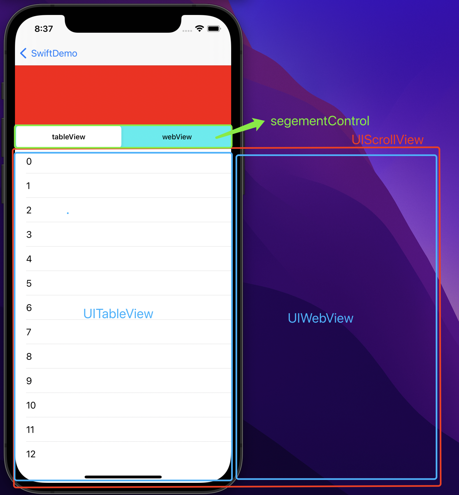

#  iOS_NestedScrollView（嵌套ScrollView）

----
## UIGestureRecognizerDelegate

首先需要了解`UIGestureRecognizerDelegate`协议的这个方法：
```
/// 是否同时相应这俩手势，默认返回 false
func gestureRecognizer(_ gestureRecognizer: UIGestureRecognizer, shouldRecognizeSimultaneouslyWith otherGestureRecognizer: UIGestureRecognizer) -> Bool {
    return true
}
```
当底部`scrollView`返回`true`时，添加在它上面的`scrollView`滑动时，它也可以滑动了。
这时候两个`scrollView`都会滑动，我们可以在滑动回调里根据当前的情况，进行处理实现想要的滑动规则了。

----
## 滑动规则制定

> 注：这个规则一定要跟交互确认好，否则规则稍有变动，改动很花时间。

实现抽屉效果如下：


下拉：`内部列表`拉到最顶部了，才放大`headerView`
上拉：先把`headerView`缩到最小，再上`滑内部列表`

----
## 实现

### 1、层级关系


- `mainScrollView`：添加在`vc.view`上，铺满。其顶部内边距`contentInset.top`等于`header`的`最大高度`-`最小高度` 即 可滑动的高度。
- `tabContainerView`：添加在`mainScrollView`上，但其`originY`是`headerView`的最小高度。
- `headerView`: 添加在`vc.view`上，置顶，其高度根据`mainScrollView.contentOffset.y`计算出来，使其正好贴在`tabContainerView`上。

> 注：这样布局的原因是：不需要频繁的修改`headerView`和`tabContainerView`的`frame`，只需要修改他们的高度就行。卡顿效果能明显减少。

----
### 2、初始化视图

```
private lazy var mainScrollView: MOMultiResponseScrollView = {
    let scroll = MOMultiResponseScrollView(frame: .zero)
    scroll.delegate = self
    scroll.bounces = false
    scroll.backgroundColor = .blue
    return scroll
}()

private lazy var headerView: UIView = {
    let view = UIView(frame: .zero)
    view.backgroundColor = .red
    return view
}()

private lazy var tabsContainerCtl: MOMultiTabContainerViewController = {
    let ctl = MOMultiTabContainerViewController(nibName: nil, bundle: nil)
    ctl.view.backgroundColor = .cyan
    return ctl
}()
```
----
- `MOMultiResponseScrollView`内部实现了`UIGestureRecognizerDelegate`，允许俩手势同时相应
```
func gestureRecognizer(_ gestureRecognizer: UIGestureRecognizer, shouldRecognizeSimultaneouslyWith otherGestureRecognizer: UIGestureRecognizer) -> Bool {
    return true
}
```
----
- `MOMultiTabContainerViewController`内部是一个`scrollView`，添加多个`subScrollView`，结构如下：(详情可见`Demo`链接里的实现文件)



----
### 3、添加视图

```
override func viewDidLoad() {
    super.viewDidLoad()
    self.view.addSubview(self.mainScrollView)
    self.mainScrollView.addSubview(self.tabsContainerCtl.view)
    self.view.addSubview(self.headerView)
}
```
----
### 4、布局

```
override func viewDidLayoutSubviews() {
    super.viewDidLayoutSubviews()
    
    let viewSize = self.view.bounds.size
    let safeInset = self.view.safeAreaInsets
    let containerWidth = viewSize.width - safeInset.left - safeInset.right
    let containerHeight = viewSize.height - safeInset.top - safeInset.bottom

    let mainScrollView = self.mainScrollView
    let headerView = self.headerView
    let tabsContainerView = self.tabsContainerCtl.view
    
    /// 铺满
    mainScrollView.frame = CGRect(x: safeInset.left,
                                  y: safeInset.top,
                                  width: containerWidth,
                                  height: containerHeight)
    mainScrollView.contentSize = CGSize(width: containerWidth,
                                        height: containerHeight)
    /// 内边距为可滑动值
    let scrollTopInset = headerViewMaxHeight - headerViewMinHeight
    mainScrollView.contentInset = UIEdgeInsets(top: scrollTopInset,
                                               left: 0.0,
                                               bottom: 0.0,
                                               right: 0.0)
    /// 高度根据偏移算出
    let headerHeight = headerViewMinHeight + abs(mainScrollView.contentOffset.y)
    headerView.frame = CGRect(x: safeInset.left,
                              y: safeInset.top,
                              width: containerWidth,
                              height: headerHeight)
    /// 高度等于剩下的范围
    tabsContainerView?.frame = CGRect(x: 0.0,
                                      y: headerViewMinHeight,
                                      width: containerWidth,
                                      height: containerHeight - headerHeight)
}
```
----
### 5、传递滑动回调

将所有滑动回调都交由`MOSubScrollExecutor`处理：（把嵌套滑动规则集中在一个文件里，方便管理和复用）

```
// MARK: - Private Methods - 主 ScrollView 的回调事件
func scrollViewWillBeginDragging(_ scrollView: UIScrollView) {
    self.scrollExecutor.mainScrollViewWillBeginDragging(scrollView)
}
func scrollViewDidScroll(_ scrollView: UIScrollView) {
    self.scrollExecutor.mainScrollViewDidScroll(scrollView)
}
```

```
private lazy var tabsContainerCtl: MOMultiTabContainerViewController = {
    let ctl = MOMultiTabContainerViewController(nibName: nil, bundle: nil)
    /// 内部 ScrollView 的回调事件
    ctl.willBeginDragging = { [weak self] (scrollView: UIScrollView) in
        self?.scrollExecutor.subScrollWillBeginDragging(scrollView)
    }
    ctl.didScroll = { [weak self] (scrollView: UIScrollView) in
        self?.scrollExecutor.subScrollDidScroll(scrollView)
    }
    ctl.view.backgroundColor = .cyan
    return ctl
}()
```
----
重点来了，打起精神~~👩‍💻

### 6、处理滑动回调

#### 6.1、标记属性:
```
/// 用于判断其最大最小状态
private var mainScrollView: UIScrollView?
/// 记录拖拽前的偏移，用于不可滑动状态时，重置偏移
private var mainScrollOffsetBeforeDragging: CGPoint = .zero
/// 是否处于可滑动状态
private var mainScrollEnable: Bool

/// 用于防重入
private var currentSubScrollView: UIScrollView?
/// 记录拖拽前的偏移，用于不可滑动状态时，重置偏移
private var subScrollViewPreOffset: CGPoint = .zero
```

#### 6.2、`helper`方法：
```
/// 判断最大最小态：
func headerIsMinState() -> Bool {
    return mainScrollView.contentOffset.y.isEqual(to: 0.0)
}

func headerIsMaxState() -> Bool {
    return mainScrollView.contentInset.top.isEqual(to: abs(mainScrollView.contentOffset.y))
}

/// 重置偏移的方法:
/// 更新 scrollView 的 offset, 相同时跳过，防止极限情况死循环
private func updateScrollView(_ scrollView: UIScrollView, _ offset: CGPoint) {
    if scrollView.contentOffset.equalTo(offset) {
        return
    }
    scrollView.contentOffset = offset;
}
```

#### 6.3、`mainScrollView`的滑动回调：
```
public func mainScrollViewWillBeginDragging(_ scrollView: UIScrollView) {
    self.mainScrollView = scrollView
    /// 记录拖拽前的偏移
    self.mainScrollOffsetBeforeDragging = scrollView.contentOffset
}

public func mainScrollViewDidScroll(_ scrollView: UIScrollView) {
    if self.mainScrollEnable {
        /// 需要重新布局，重新计算 headerView 和 containerView 的高度
        /// 触发 MONestedScrollViewController 的 viewDidLayoutSubviews 方法
        self.mainScrollSuperView?.setNeedsLayout()
        return
    }
    /// 不可滑动时，重置偏移
    self.updateScrollView(scrollView, self.mainScrollOffsetBeforeDragging)
}
```

#### 6.4、`subScrollView`的滑动回调：
```
public func subScrollWillBeginDragging(_ scrollView: UIScrollView) {
    /// 切换tab时重置标记位
    if self.currentSubScrollView != nil &&
        !self.currentSubScrollView!.isEqual(scrollView) {
        self.mainScrollEnable = true
    }
    self.currentSubScrollView = scrollView
    self.subScrollViewPreOffset = scrollView.contentOffset
}

public func subScrollDidScroll(_ scrollView: UIScrollView) {
    /// 丢弃其他scrollView的回调(case: 刚拖拽完tabView，立马切换到webView，此时还会收到tabView的滑动回调)
    if !scrollView.isEqual(self.currentSubScrollView) {
        return
    }
    if scrollView.contentOffset.y.isEqual(to: self.subScrollViewPreOffset.y) {
        return
    }
    let pullDown: Bool = scrollView.contentOffset.y < self.subScrollViewPreOffset.y
    if pullDown {
        self.handlePullDown(scrollView) /// 处理下拉
    } else {
        self.handlePullUp(scrollView)   /// 处理上拉
    }
}
```

#### 6.5、处理`subScrollView`下拉：
```
/// 下拉: list 先拉到顶，再放大 headerView
func handlePullDown(_ scrollView: UIScrollView) {    
    /// 还没拉到顶 或 headerView已是最大状态，允许subScrollView滑动，不做处理
    if scrollView.contentOffset.y > 0 ||
        self.headerIsMaxState() {
        self.mainScrollEnable = false
        self.subScrollViewPreOffset = scrollView.contentOffset
    } else {
        /// 拉到顶部了 且 播放器需要放大
        self.mainScrollEnable = true
        
        /// 重置偏移(放大player时，不需要下拉刷新效果)
        self.updateScrollView(scrollView, .zero)
        self.subScrollViewPreOffset = .zero
    }
}
```

#### 6.6、处理`subScrollView`上拉：
```
/// pullUp 上拉: 先缩小播放器，再拉 list
func handlePullUp(_ scrollView: UIScrollView) {    
    /// headerView 已是最小状态，允许subScrollView滑动，不做处理
    if self.headerIsMinState() {
        self.mainScrollEnable = false
        self.subScrollViewPreOffset = scrollView.contentOffset
        return
    }
    self.mainScrollEnable = true
    if scrollView.contentOffset.y <= 0 { /// 忽略下拉刷新的回弹(否则死循环)
        return
    }
    print("heanderView缩小时，重置subScrollView偏移")
    self.updateScrollView(scrollView, self.subScrollViewPreOffset)
}
```
----
## 注意事项

由于`UIScrollView`的`contentOffset`的精确度问题，所以再计算或判等时需要特别注意。
（因为`Demo`只是为了传递实现思想，所以用的都是整数，不会有精确度的问题）

----
[Demo](https://github.com/mxh-mo/MONestedScrollView)


