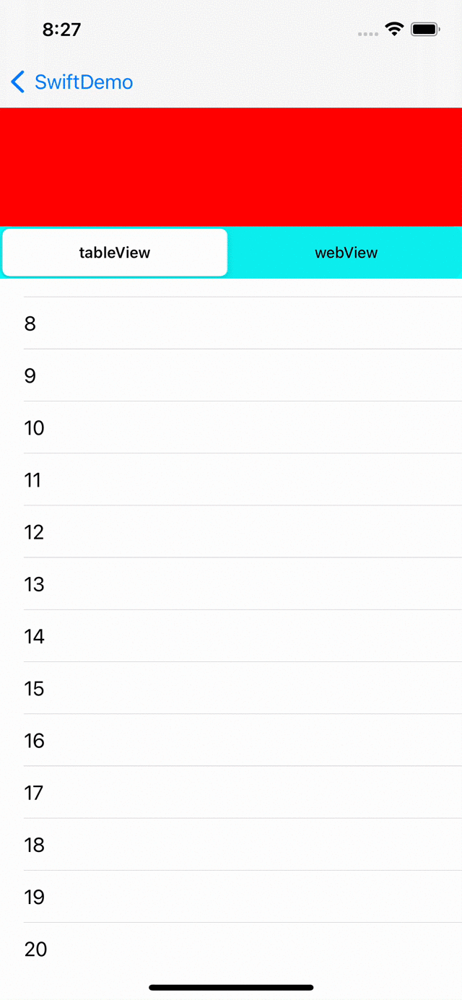
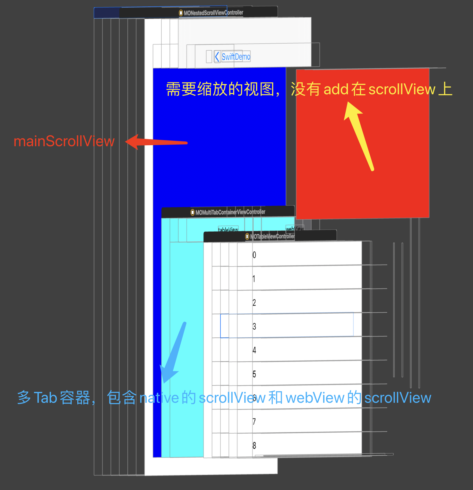

# MONestedScrollView

The effect:



# How to use

add the `MOSubScrollExecutor.swift` file to your project

## 1、Init a instance
```swift
private lazy var scrollExecutor: MOSubScrollExecutor = {
    let exector = MOSubScrollExecutor()
    /// use for setNeedsLayout
    exector.mainScrollSuperView = self.view
    return exector
}()
```

## 2、mainScrollView implementation this method

```swift
// Mark: - UIGestureRecognizerDelegate
/// if corresponding these two gestures at the same time
func gestureRecognizer(_ gestureRecognizer: UIGestureRecognizer, shouldRecognizeSimultaneouslyWith otherGestureRecognizer: UIGestureRecognizer) -> Bool {
    return true
}
```

## 3、send mainScrollView delegate to this instance

```swift
func scrollViewWillBeginDragging(_ scrollView: UIScrollView) {
    self.scrollExecutor.mainScrollViewWillBeginDragging(scrollView)
}

func scrollViewDidScroll(_ scrollView: UIScrollView) {
    self.scrollExecutor.mainScrollViewDidScroll(scrollView)
}
```

## 4、send subScrollView delegate to this instance

```swift
private lazy var tabsContainerCtl: MOMultiTabContainerViewController = {
    let ctl = MOMultiTabContainerViewController(nibName: nil, bundle: nil)
    /// 内部 ScrollView 的回调事件
    ctl.willBeginDragging = { [weak self] (scrollView: UIScrollView) in
        self?.scrollExecutor.subScrollWillBeginDragging(scrollView)
    }
    ctl.didScroll = { [weak self] (scrollView: UIScrollView) in
        self?.scrollExecutor.subScrollDidScroll(scrollView)
    }
    ctl.view.backgroundColor = .cyan
    return ctl
}()
```

## 5、attention to hierarchy



- `mainScrollView`：add to `vc.view`, `fame = view.bounds`. `contentInset.top` = `headerMaxHeight` - `headerMixHeight`. namely scroll distance on the y-axis.
- `tabContainerView`：add to `mainScrollView`, `originY` = `headerMinHeight`.
- `headerView`: add to `vc.view`, `originY = 0.0`, calculate the height according to `mainScrollView.contentOffset.y`. make it fit on the `tabcontainerview`.


> Note: the reason for this layout is that it is not necessary to frequently modify the `frame` of `headerview` and `tabcontainerview`, just should to modify their heights. The Caton effect can be significantly reduced.

such as:

```swift
override func viewDidLoad() {
    super.viewDidLoad()
    self.view.backgroundColor = .white
    self.view.addSubview(self.mainScrollView)
    self.mainScrollView.addSubview(self.tabsContainerCtl.view)
    self.view.addSubview(self.headerView)
}
```

## 6、calculate frame in viewDidLayoutSubviews

such as:
```swift
override func viewDidLayoutSubviews() {
    super.viewDidLayoutSubviews()
    
    let viewSize = self.view.bounds.size
    let safeInset = self.view.safeAreaInsets
    let containerWidth = viewSize.width - safeInset.left - safeInset.right
    let containerHeight = viewSize.height - safeInset.top - safeInset.bottom

    let mainScrollView = self.mainScrollView
    let headerView = self.headerView
    let tabsContainerView = self.tabsContainerCtl.view
    
    /// Spread
    mainScrollView.frame = CGRect(x: safeInset.left,
                                  y: safeInset.top,
                                  width: containerWidth,
                                  height: containerHeight)
    mainScrollView.contentSize = CGSize(width: containerWidth,
                                        height: containerHeight)
    /// The inner margin is a slidable value
    let scrollTopInset = headerViewMaxHeight - headerViewMinHeight
    mainScrollView.contentInset = UIEdgeInsets(top: scrollTopInset,
                                               left: 0.0,
                                               bottom: 0.0,
                                               right: 0.0)
    /// The height is calculated according to the offset
    let headerHeight = headerViewMinHeight + abs(mainScrollView.contentOffset.y)
    headerView.frame = CGRect(x: safeInset.left,
                              y: safeInset.top,
                              width: containerWidth,
                              height: headerHeight)
    /// The height is equal to the remaining range
    tabsContainerView?.frame = CGRect(x: 0.0,
                                      y: headerViewMinHeight,
                                      width: containerWidth,
                                      height: containerHeight - headerHeight)
}
```

---
That's all, Thank you ~